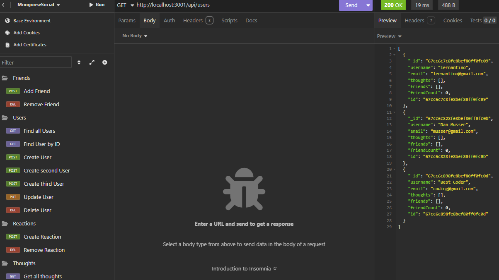

# MongooseSocial
A backend API for a social network application, built using MongoDB, Express.js, and Mongoose.

## Description
It is designed to allow users to share thoughts, react to friends' posts, and manage a friend list, all while storing data in a flexible, scalable NoSQL database. The API enables users to perform CRUD (Create, Read, Update, Delete) operations on users, thoughts, and reactions, offering a foundation for social networking applications.

## Table of Contents
 - [Installation](#installation)
 - [Usage](#usage)
 - [Credits](#credits)
 - [License](#license)
 - [Badges](#badges)
 - [Tests](#tests)
 - [Questions](#questions)

## [Installation](#installation)
  1. Clone this repo locally;
  2. Validate you have MongoDB installed locally; 
  3. Create a .env with `MONGODB_URI='mongodb://127.0.0.1:27017/mongooseSocial-db'`;
  4. Install dependencies by running `npm i` in your terminal from the root; 
  5. Run build with `npm run start`;
  6. Import the Insomnia collection from `./Resources/Insomnia_MonogooseSocial.json`; and
  7. Interact with each API route.

  ## [Usage](#usage)
  Use this to add users, connect friends, manage thoughts, and allow reactions.  View a demo of the application here: [Youtube Demo Video](https://youtu.be/RwGLElLoCmU).
  
  ### Application Screenshot
  

  ## [Credits](#credits)
  - [dayjs](https://day.js.org/)
  - [dotenv](https://www.npmjs.com/package/dotenv)
  - [express](https://expressjs.com/)
  - [MongoDB](https://www.mongodb.com/)
  - [mongoose](https://mongoosejs.com/)
  - [validator](https://www.npmjs.com/package/validator)
   - In Dev
      - [nodemon](https://nodemon.io/)
  
  ## [License](#license)
  This project is licensed under the MIT - see the [LICENSE](LICENSE) file for details.

  ## [Badges](#badges)
  

  ## [Tests](#tests)
   Follow [Installation](#installation) and run application locally. Follow errors for tracing.
  
  ## [Questions](#questions)
  If you have any questions, please feel free to reach out to me at musserdn@gmail.com or visit my [GitHub Profile](https://github.com/musserdn/).